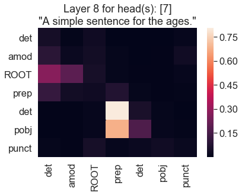

# Spacyface aligner

Align [Huggingface Transformer](https://github.com/huggingface/transformers) model tokenizations with linguistic metadata provided by [spaCy](https://spacy.io/)!

*Currently only supports English tokenizations*

## Getting started

### Pip
1. Run `pip install spacyface`.
2. `python -m spacy download en_core_web_sm`

### Manual (Clone and conda)
1. From the root of this project, create a new conda directory with `conda env create -f environment.yml`. This will create an environment named `spacyface`.
2. Activate this environment with `conda activate spacyface`. At this point, if you want to install the development dependencies, you can do so with `conda env update -f environment-dev.yml`
3. You will need to install spacy's `en_core_web_sm` as well. To do this, run: `python -m spacy download en_core_web_smo`

## Usage
### Basic Usage on a sentence
Every aligner can be created and used as described in the example below:

``` python
from aligner import BertAligner

alnr = BertAligner.from_pretrained("bert-base-cased")
sentence = "Do you know why they call me the Count? Because I love to count! Ah-hah-hah!"
tokens = alnr.meta_tokenize(sentence)
print("Tokens:\n\n", [(tok.token, tok.pos) for tok in tokens])
```

```
Tokens:

   [('Do', 'AUX'), ('you', 'PRON'), ('know', 'VERB'), ('why', 'ADV'), ('they', 'PRON'), ('call', 'VERB'), ('me', 'PRON'), ('the', 'DET'), ('Count', 'PROPN'), ('?', 'PUNCT'), ('Because', 'SCONJ'), ('I', 'PRON'), ('love', 'VERB'), ('to', 'PART'), ('count', 'VERB'), ('!', 'PUNCT'), ('Ah', 'INTJ'), ('-', 'PUNCT'), ('ha', 'X'), ('##h', 'X'), ('-', 'PUNCT'), ('ha', 'NOUN'), ('##h', 'NOUN'), ('!', 'PUNCT')]
```

Because the information is coming directly from spaCy's `Token` class, any information that spaCy exposes about a token can be included in the huggingface token. The user only needs to modify the exposed attributes in the [SimpleSpacyToken](./aligners/simple_spacy_token) class.

This can also be extrapolated to tokenize entire English corpora with the use of a generator. An example raw corpus representing a subset of wikipedia is included in the [[./tests]] directory.

### Observing attention between linguistic features
This library also enables us to look at the attention pattern heatmaps for a particular layer and a particular head in terms of the linguistic features that belong to that layer and head.

``` python
alnr_cls = RobertaAligner
model_name = "roberta-base"
sentence = "A simple sentence for the ages."
layer = 8
heads = [7]

alnr = alnr_cls.from_pretrained(model_name)
model = AutoModel.from_pretrained(model_name, output_attentions=True)
model.eval() # Remove DropOut effect

model_input, meta_info = alnr.sentence_to_input(sentence)

_, _, atts = model(**model_input)

to_show = atts[layer][0][heads].mean(0)[1:-1, 1:-1] # Don't show special tokens for Roberta Model

deps = [t.dep for t in meta_info[1:-1]]
poss = [t.pos for t in meta_info[1:-1]]

plt.figure()
sn.set(font_scale=1.5)
sn.heatmap(to_show.detach().numpy(), xticklabels=deps, yticklabels=deps)
plt.title(f"Layer {layer} for head(s): {heads}\n\"{sentence}\"")
```



Interestingly, we have discovered that Layer 8, head 7 has a strong affinity for a POBJ (Object of the Preposition) looking at a PREP (Preposition). Cool! We can then test this hypothesis by running example sentences that have multiple prepositions to see if it is looking at all prepositions or just the preposition related to the object.


## Background
Different transformer models use different tokenizations. At the time of this writing, many these tokenizations split larger English words into smaller tokens and use different methods of indicating that a token was once part of a larger word.

For inspection and research, it is helpful to align these tokenizations with the linguistic features of the original words of the sentence. [spaCy](https://spacy.io/) is a fantastic python library for assigning linguistic features (e.g., dependencies, parts of speech, tags, exceptions) to the words of different languages, but its method for tokenizing is vastly different from the tokenization schemes that typically operate on the sub-word and sometimes byte level. This repository aims to align spaCy tokens with the sub-word tokens needed for training and inference of the different [Huggingface Transformer](https://github.com/huggingface/transformers) models.

In short, *this repository enables the strange and varied tokenizations belonging to different transformer models to be correctly annotated with the metadata returned by spaCy's tokenization.*

Currently, the repository only supports the English language and the following huggingface pretrained models:

- Bert
- GPT2 (covers distilgpt2)
- Roberta (covers distilroberta)
- DistilBert
- TransfoXL
- XLNet
- XLM
- Albert
- CTRL
- OpenAIGPT
- XLMRoberta

At the time of release, the only model that doesn't work with the alignment is the T5 Tokenization scheme.

Originally created to ease the development of [exBERT](http://exbert.net/), these tools have been made available for others to use in their own projects as they see fit.

## Testing the aligner
A few edge case sentences that include hardcoded exceptions to the English language as well as strange punctuation have been included in [EN_TEST_SENTS.py](./tests/EN_TEST_SENTS.py). You can run these tests on the established aligners with `python -m pytest` from the root folder.

Sometimes, your application may not care about edge cases that are hard to detect. You can test an alignment on a more representative subset of the English language with the included [wikipedia subset](./tests/wiki.test.txt), or use your own text file corpus. To do this, run

``` python
from spacyface import TransfoXLAligner
from spacyface.checker import check_against_corpus
corpus = 'tests/wiki.test.txt'
alnr = TransfoXLAligner.from_pretrained('transfo-xl-wt103')
check_against_corpus(alnr, corpus)
```

and wait a few minutes to see if any sentences break.

## Notable Behavior and Exceptions
This repository makes the large assumption that there is no English "word" which is smaller than a token needed for a transformer model. This is an accurate assumption for most of the published transformer models.

It is difficult to align such completely different tokenization schemes. Namely, there are a few strange behaviors that, while not desired, are intentional to create a simplified methods to aligned different tokenization schemes. These behaviors are listed below.

- Multiple consecutive spaces in a sentence are replaced with a single space.
- Many tokenizers insert special tokens (e.g., "[CLS]", "[SEP]", "[MASK]", "\<s\>") for certain functionalities. The metadata for all these tokens is assigned to `None`.
- When a token exists as a part of a larger word, the linguistic information belonging to the larger word is bestowed on the token.
- The English language is riddled with exceptions to tokenization rules. Sometimes, a punctuation is included in the middle of what is a single token (e.g., "Mr." or "N.Y."). Other times, contractions that look nothing like the words it combines (e.g., "ain't" looks nothing like "is not" or "am not" or "are not") create difficulties for aligning. To prevent these from being an issue, this repository replaces the exceptions to the language with their original "normalized" representations.

**Specific to GPT2**
- Sometimes, GPT2 tokenization will include a space before a punctuation mark that should not have been there. For example, the tokenization of "Hello Bob." should be `["Hello", "ĠBob", "."]`, but it is instead `["Hello", "ĠBob", "Ġ."]` This has not had any notable effects on performance, but note that it is different from the way the original model was pretrained. Hidden representations may be slightly different.

### Known Issues
- A Spacy exception that is part of a `-`-delimited word (e.g. "dont-touch-me") will cause the meta tokenization to produce a different result from the tokenization strategy. See github issues for a more detailed description of this problem.

### Acknowledgements

- Benjamin Hoover (IBM Research & MIT-IBM Watson AI Lab)
- Hendrik Strobelt (IBM Research & MIT-IBM Watson AI Lab)
- Sebastian Gehrmann (Harvard NLP)
